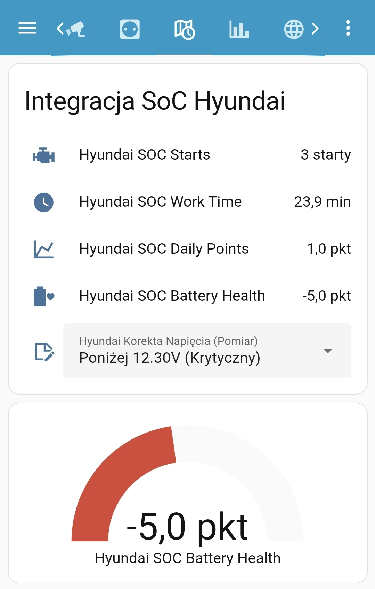

# Car Battery SoC – integracja Home Assistant

## Opis

Integracja służy do **monitorowania stanu naładowania akumulatora samochodowego** na podstawie:




* liczby rozruchów silnika,
* czasu jazdy.

Estymacja odbywa się na podstawie informacji **Bluetooth z telefonu**.
Integracja **nie posiada fizycznego połączenia** z elektroniką samochodu.

---

## Wymagania sprzętowe

1. Samochód wyposażony w Bluetooth.
2. Zainstalowana aplikacja **Home Assistant** na smartfonie.

---

## Jak to działa

1. Należy znać **adres MAC** urządzenia audio (Bluetooth) w samochodzie.

2. Gdy telefon **automatycznie sparuje się** z systemem audio auta:
   
   * integracja zaczyna zliczać liczbę połączeń,
   * mierzony jest czas trwania połączenia (czas jazdy).

Na tej podstawie obliczany jest przybliżony stan naładowania akumulatora.

---

## Algorytm punktowy

Integracja wykorzystuje algorytm punktowy określający poziom naładowania akumulatora.
Punkty są **dodawane lub odejmowane** w zależności od sposobu użytkowania auta.

### Zmiany punktów

* **Dzień bez jazdy:** −2 pkt
  *(samorozładowanie + pobór prądu na czuwaniu / alarm)*

* **Jazda < 10 min:** −1 pkt
  *(koszt rozruchu większy niż doładowanie z alternatora)*

* **Jazda 10–20 min:** +1 pkt
  *(bilans bliski zera lub lekki plus)*

* **Jazda 20–40 min:** +3 pkt
  *(dobre doładowanie)*

* **Jazda > 40 min:** +6 pkt
  *(pełna regeneracja akumulatora)*

---

## Interpretacja punktów

| Punkty        | Status | Opis                                          |
| -------------:|:------:| --------------------------------------------- |
| **> 20 pkt**  | 🟢     | Super – akumulator w pełni naładowany         |
| **10–20 pkt** | 🟡     | OK – stabilny stan                            |
| **0–10 pkt**  | 🟠     | Uwaga – zalecana dłuższa jazda                |
| **< 0 pkt**   | 🔴     | Krytycznie – wymagane ładowanie prostownikiem |

---

## Instalacja

### 1. Smartfon (Android)

1. W aplikacji **Home Assistant** przejdź do:
   
   `Ustawienia → Aplikacja towarzysząca → Zarządzaj sensorami → Sensory Bluetooth`

2. Włącz sensor **Połączenie Bluetooth**.

3. Po aktywacji:
   
   * kliknij sensor **Połączenie Bluetooth**,
   * w sekcji `paired_devices` odczytaj **adres MAC** zestawu audio samochodu.

---

### 2. Home Assistant

1. Przejdź do:
   
   `Ustawienia → Urządzenia oraz usługi → Aplikacja mobilna`

2. Kliknij nazwę swojego telefonu.

3. Odszukaj sensor **Bluetooth connection** i skopiuj jego nazwę, np.:
   
   ```
   sensor.sm_a546b_bluetooth_connection
   ```

---

### 3. Integracja *Car Battery SoC*

1. Wpisz **rozpoznawalną nazwę auta**.
2. W polu `bluetooth_entity` wklej nazwę sensora Bluetooth (np. `sensor.sm_a546b_bluetooth_connection`).
3. Wklej **adres MAC** urządzenia audio w samochodzie.

---

## Uwagi

* Integracja ma charakter **orientacyjny** – nie zastępuje pomiarów napięcia.
* Najlepiej sprawdza się przy **regularnym użytkowaniu** auta.
* Estymowane dla akumulatora AGM 70Ah i silnika 1.4 z systemem start-stop.
